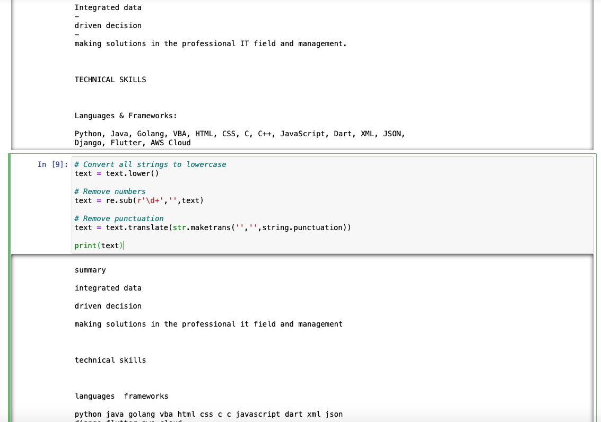

# Resume_Scanner_Python
Python script that matches your resume to the job description and other industry terms.

## Getting Started

First create a text file that has the job description such as languages and tools.
Upload resume and text file to Jupyter Notebook. Install the python packages before running script.

### Installation
You can find the installation documentation for the
[Jupyter platform, on ReadTheDocs](https://jupyter.readthedocs.io/en/latest/install.html).
The documentation for advanced usage of Jupyter notebook can be found
[here](https://jupyter-notebook.readthedocs.io/en/latest/).

For a local installation, make sure you have
[pip installed](https://pip.readthedocs.io/en/stable/installing/) and run:

    $ pip install notebook

## Usage - Running Jupyter notebook

### Running in a local installation

Launch with:

    $ jupyter notebook

### Running in a remote installation

You need some configuration before starting Jupyter notebook remotely. See [Running a notebook server](https://jupyter-notebook.readthedocs.io/en/stable/public_server.html).
End with an example of getting some data out of the system or using it for a little demo

### Packages

Packages to install on Jupyter Notebook

```
!pip install PyPDF2
!pip install textract
!pip install pandas
!pip install matplotlib
!pip install python-csv
!pip install more-itertools
```

## Data Cleanse

Prepare the key terms by saving the job description as a text file. Use the Job_Posting_KeyTerms.py to turn textfile to a one dimentional list.


Read and data cleanse resume to lower case paragraphs. The resume will be used to match the job posting key terms. 



### Data Visualizations

The scores are the number of times the key terms have occurred in the resume. The job posting is for a data analyst position.
The other sectors are key terms are for industrial engineering canidates.


The pie chart gives a percentage of term occurances in the resume compared to other industry sectors. 


## Authors

* **rsalaza4** - *Initial work* - [Resume_Screening-Complete_Code](https://gist.github.com/rsalaza4/a7dfb75fedca3aeb95c5cbe4bad618ce)
* **Crystal14w** - *Preparing Text File* - [Job Posting KeyTerms](https://github.com/Crystal14w/Resume_Scanner_Python/blob/patch_1/Job_Posting_KeyTerms.py) 

## Acknowledgments

*Thanks to Roberto Salazar for publishing an informative article on Resume Screening industrial engineering terms.

## Resources
- [Project Jupyter website](https://jupyter.org)
- [Medium Article ](https://towardsdatascience.com/resume-screening-with-python-1dea360be49b)
